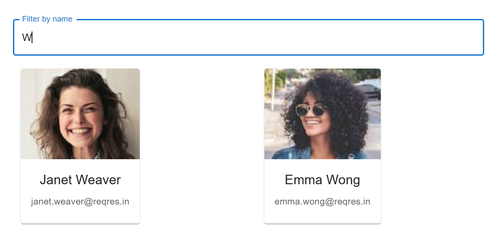

# User Grid
Build a responsive React application that fetches a list of users from a public API and displays them using Material UI components. 

## Step 1: Fetch Data
Use the endpoint https://reqres.in/api/users to fetch user data. You have to get a free API key from [Reqres.in](https://reqres.in/) website to access the REST API.

Handle loading and error states appropriately.

## Step 2: Display Users
Use Material UI’s Card component to display each user. Read the Card component documentation in https://mui.com/material-ui/react-card/.

Each card should show:
- User’s avatar
- Full name
- Email address

Arrange the cards in a responsive grid layout using Material UI’s Grid system. Read the Grid component documentation in https://mui.com/material-ui/react-grid/.

### Example output:

### Step 3: User Filter
Enhance the user interface by implementing a real-time search filter. Add a text input field that allows users to filter the list of fetched users based on their name. As the user types in the input field, the displayed list of users should dynamically update to only include those whose names contain the entered search string (case-insensitive match). 

- Add a text input field above the user list.
- Listen for changes in the input field and update the displayed list.
- Implement a case-insensitive filter against users' full names (e.g., first name + last name).

### Example output:

